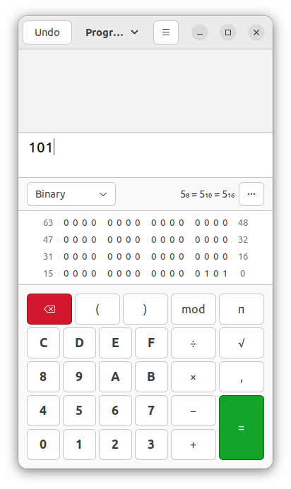

# cpp-course

Tot: https://youtu.be/8jLOx1hD3_o?t=19919

C++ Course

See course: https://www.youtube.com/watch?v=8jLOx1hD3_o

course code: https://github.com/rutura/The-C-20-Masterclass-Source-Code


# Environment information
C++ compiler support: https://en.cppreference.com/w/cpp/compiler_support 

GCC compiler: https://gcc.gnu.org/

Windows: gcc + clang: https://winlibs.com

Configure c++ standard: https://stackoverflow.com/questions/66975491/how-to-use-c-20-in-g

## Online compilers
- Wandbox https://wandbox.org 
- Compiler Explorer https://godbolt.org 
- Coliru https://coliru.stacked-crooked.com 
- ...

## Errors and warnings
[example-02](example-02)

There are three types errors/warnings
- compiletime errors
- runtime errors
- warnings (compiletime/runtime)

## Statements and Functions
[example-03](example-03)
- A statement is the basic unit of computation in a C++ program
- Every c++ program is a collection of statements ment to achieve some goal
- Statements end with a semicolon
- Statements are executed in order of appearance - staring at main function
- A function has input(s) and one output - the functions is the transformatione from input(s) to the output
- A functions must be defined before it is used

## Data input/output
[example-04](example-04)

There are different options

- std::cout printing data to the terminal (console - stdout)
- std::cin  reading data from the terminal (stdin)
- std::cerr printing errors the the terminal (stderr)
- std::clog printing log messages to the console
  
## C++ program execution model and memory model

In [image](images/program.jpg) a program as represented by the program area is stored on the hard drive and executed by the cpu.
See explanation on https://youtu.be/8jLOx1hD3_o?t=10346 

A C++ program is build with
- core features, datatypes, variables
- standard library, for instance iostream
- stl, standard template library with container with types, algorithms and functions


## Variables and datatypes

A number of variables are possible:
- int
- double
- float
- char, a simple character like 'a', 'b'
- bool, true or false
- void, typeless type
- auto, deduce type
- ...

A variable are number of 0/1's - a bit. The 0/1's are grouped together to make sense.

See also https://en.cppreference.com/w/cpp/types/numeric_limits 

### Number systems
The computer uses a binary number system.
For instance 101 means 1x2^2 + 0x2^1 + 1x2^0.



n digits represents 0..2^(n-1) different numbers.

unsigned range [0..2^n - 1]

signed range -2^(n-1) .. 2^(n-1)-1

|digits|bytes|             data range| data type|
|-----:|----:|----------------------:|---------:|
|     4|    1|                  0..16|    octet |
|     8|    1|                 0..255|     byte |
|    16|    2|               0..65535|      int |
|    32|    4|         0..34359738367|     long |
|    64|    8|0..18446744073709551615|   double |


Bron: https://en.cppreference.com/w/cpp/language/types
|                  Type | Size in bits |   Format |              Value range |
|-----------------------|-------------:|---------:|-------------------------:|
|                  char |            8 |   signed |                -128..127 |
|                  char |            8 | unsigned |                   0..255 |
|                  char |           16 |   UTF-16 |                 0..65535 |
|                  char |           32 |   UTF-32 |               0..1114111 |
|                   int |           16 |   signed |            -32768..32767 |
|                   int |           16 | unsigned |                 0..65535 |
|                   int |           32 |   signed |  -2147483648..2147483647 |
|                   int |           32 | unsigned |            0..4294967295 |
|                   int |           64 |   signed |  -9223272036854775808..9223372036854775807 |
|                   int |           64 | unsigned |            0..18446744073709551615 |
| binary floating point |           32 | IEEE-754 | 0x1^-149..0x1.fffffe^127 |
| binary floating point |           64 | IEEE-754 | 0x1^−1074..0x1.fffffffffffff^+1023|
| binary floating point |           80 | IEEE-754 | 0x1^−16445..0x1.fffffffffffffffe^+16383|
| binary floating point |          128 | IEEE-754 | 0x1^−16494..0x1.ffffffffffffffffffffffffffff
^+16383|


Representation of 15 in different number systems
```cpp
int n1 = 15;         // decimal
int n2 = 017;        // octal
int n3 = 0x0f;       // hexadecimal
int n4 = 0b00001111; //binary
```

## Naming
Variables should start with a letter or an underscore.
Variable names are case sensative.
You cannot use spaces in variable names.
Format for declaration of a variable

```
typename variablename {initial value}
```

## Floating point
| type        | size | precision|              comment|
|------------:|-----:|---------:|---------------------|
| float       |  4   |        7 |                     |
| double      |  8   |       15 | recommended default |
| long double | 12   | > double |                     |

## Boolean
Only two values: true or false

Booleans use 1 byte storage

## Characters

Datatype char is ASCII value. See https://en.wikipedia.org/wiki/ASCII

Unicode is out of scope for this course. See https://stackoverflow.com/questions/3010739/how-to-use-unicode-in-c


## Auto datatype
The compiler tries to deduce the type based on value.
Best practice don't use.

## Operations

### Division
With integers you only get the hole number, not the remainder.
To get the remainder use '%' the modulo operator.

### Preference

See https://en.cppreference.com/w/ for general language documentation
and https://en.cppreference.com/w/cpp/language/operator_precedence for operator precedence